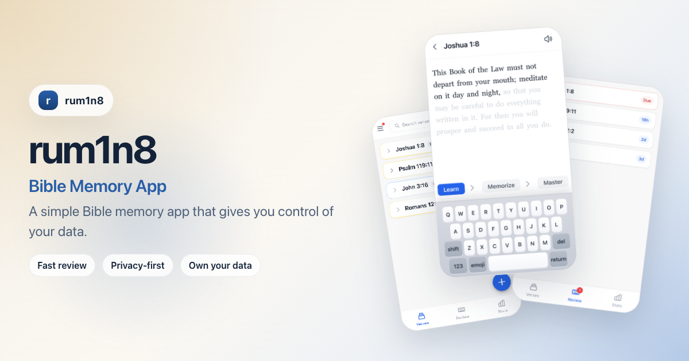

# rum1n8 - Bible Memory App

*Pronounced "Ruminate"* — to turn something over in the mind; to meditate or reflect on deeply. Inspired by Joshua 1:8:

> "This Book of the Law must not depart from your mouth; meditate on it day and night, so that you may be careful to do everything written in it. For then you will prosper and succeed in all you do." — Joshua 1:8 (BSB)

[Open rum1n8](https://rum1n8.unrau.xyz)

## Why rum1n8 exists

I built rum1n8 to solve the frustrations I had with existing Bible memory apps. They were slow and bloated with too many features, had artificial paywalls and limits, and made it difficult or impossible to export my data. Here's how rum1n8 differs:

- **No accounts.** Open the app and use it. No signup, no login, no account required.
- **You own your data.** Other memory apps do not make it easy to export what you have put into them. rum1n8 keeps your data on your device by default, lets you back it up to a file you can read, and you can sync it with your own Google Drive or WebDAV server.
- **Free.** No artificial usage limits. No subscriptions. No paywalls.
- **No bloat.** The app is intentionally simple, focused, and fast. It is built around first-letter typing, active recall, and spaced repetition instead of piling on extra features and options.
- **Fast review and fast verse entry.** It takes seconds to start reviewing. Adding verses does not take a hundred taps through a bunch of screens. Type a reference or verse range, import the verse text, and start.
- **Not tied to an app store.** rum1n8 is an installable offline web app, so it is not at the mercy of Apple or Google deciding whether it stays on their platforms.
- **You can truly own your own copy of the app.** Most apps only give you permission to use them, and if the owner stops supporting them, you can lose access. rum1n8 is self-hostable and released under the [MIT License](LICENSE), so you can copy the whole app, run it yourself, and not depend on me to keep it online forever.

## Features

- **Guided memorization:** Move through Learn, Memorize, and Master as the app gradually removes help.
- **Spaced repetition:** Mastered verses come back for review before they fade from your memory.
- **First-letter typing:** Practice quickly by typing the first letter of each word.
- **Quick verse entry:** Add a verse by typing a reference or range like `Joshua 1:8-9`, then import the verse text.
- **A clean verse library:** Organize verses into collections, search quickly, and track progress with stats.
- **Portable data:** Backup and restore your library, import by CSV, or sync across devices with Google Drive or your own WebDAV server.

## Why memorization matters to me

I started building rum1n8 when I got serious about Scripture memorization myself. Memorization has been one of the most impactful spiritual disciplines in my walk with Jesus. Even when it is only five minutes a day, I have found that it gives me more peace, less anxiety, fewer negative thoughts, clearer thinking, more focus on God, more Scripture in prayer, and more readiness to share a verse with someone in the moment.

As the number of verses I had memorized grew, my memorization data — which verses I had memorized and when to review them next — became very personal and valuable to me. I did not want something that meaningful trapped inside someone else's app with no clear way to get it back out. rum1n8 was built to give me, and anyone else who wants it, control over their memorization data.

## Dedication

Church Renewal International first taught me the importance of daily time in the Bible and prayer, and introduced me to the practice of memorization. This app is dedicated to them. If you want to support their work, you can [donate to Church Renewal International](https://churchrenewal.com/donate).

## Recommended devotional resource

I also recommend [TheWay.app](https://theway.app), a devotional and discipleship resource from Church Renewal International.

## More docs

- [Developer notes](docs/developer.md)
- [Hosting notes](docs/hosting.md)
